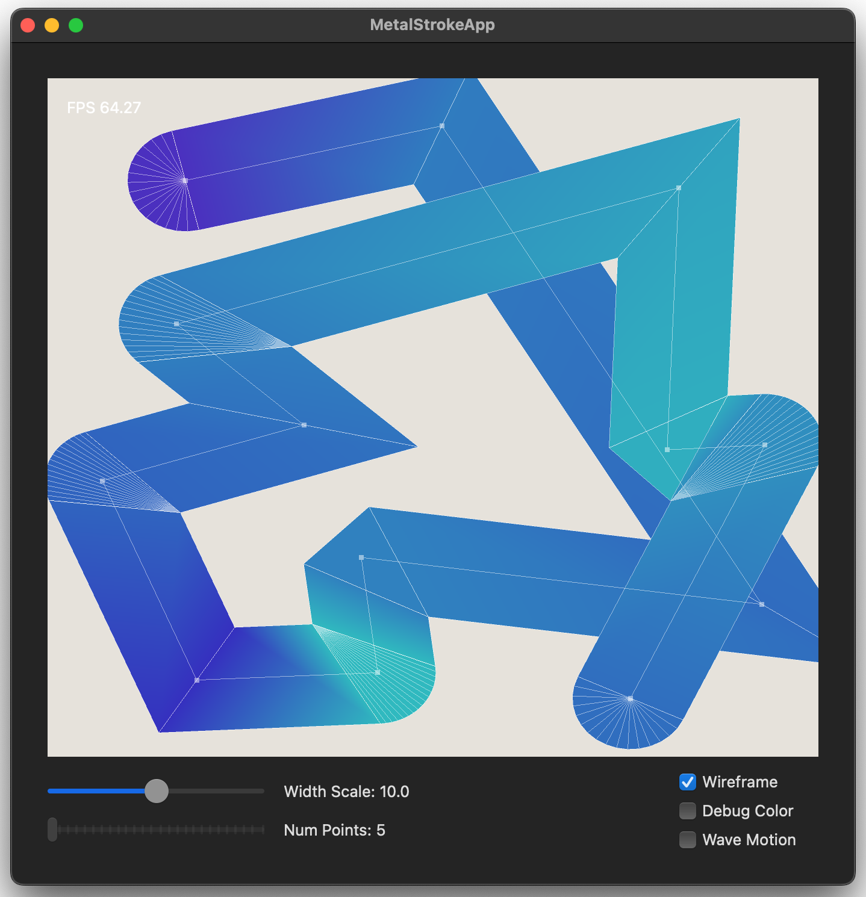
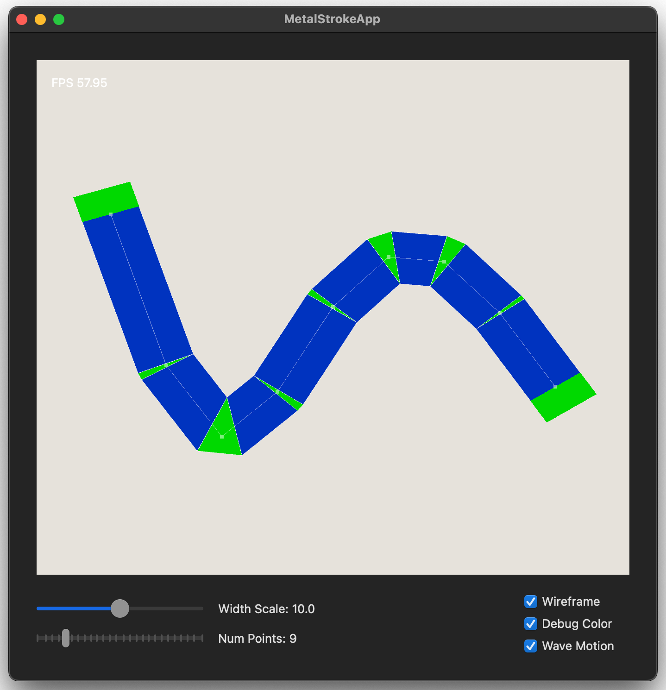

# MetalStrokeApp

A stroke-drawing app built with Metal + SwiftUI.  
Created as a small exercise in learning Metal, focusing on implementing the basic features of stroke rendering.

## Features 

### Per-vertex control over:
  - Color
  - Radius (stroke width)
  - Join type (`miter`, `bevel`, `round`)
  - Cap type (`butt`, `square`, `round`)
  - Z-position

So you can
- make gradient along stroke
- make tapered line
- overlap strokes with proper depth ordering (under or over)

### Make full use of instanced drawing
- No per-frame mesh construction on the CPU
  - only list of vertex & attributes are passed to shaders
- Entire stroke is formed from basic 3 shapes (quad, triangle, pie)
  - each is deformed in the vertex shader
  - no polygon overlapping in caps/joins
    - works well with gradients, alpha blending
    - (still not working well with miter-limited angles)
- Maximum 3 draw calls for infinite number & types of strokes
  - rendering is separated by base shape type, not by individual strokes
  - all results are composited using proper depth testing

## Limitations
- No UI for selecting joins/caps (currently chosen randomly 😉)

## Try Drawing
You can draw strokes manually by:

- **Left click** to add a point with randomized color
  - drag to adjust latest position
- **Right click** to clear the canvas
- **Return key (⏎)** to finalize a stroke

## Try Drawing (by code)
Modify the code in
- `InteractiveMTKView(...)`: Handles mouse events
- `FrameUpdater.update(...)`: Generates wave motion
